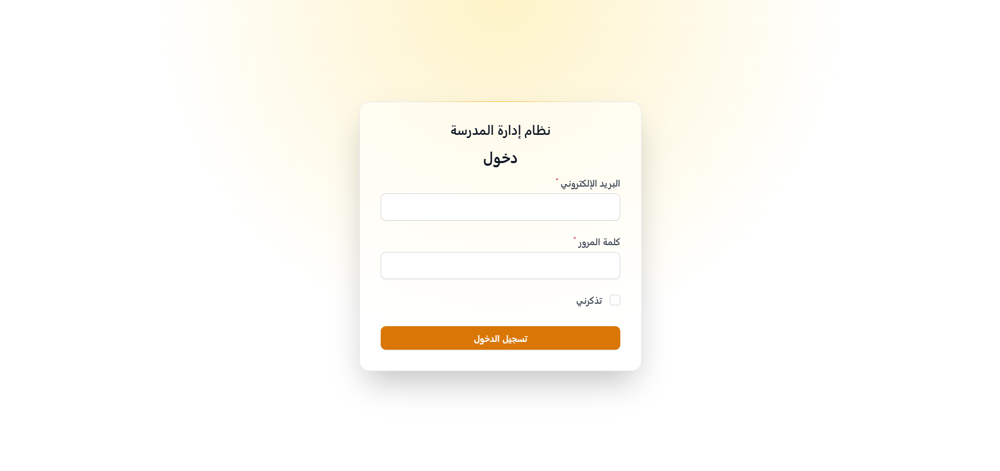
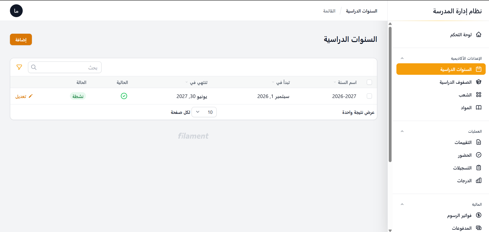
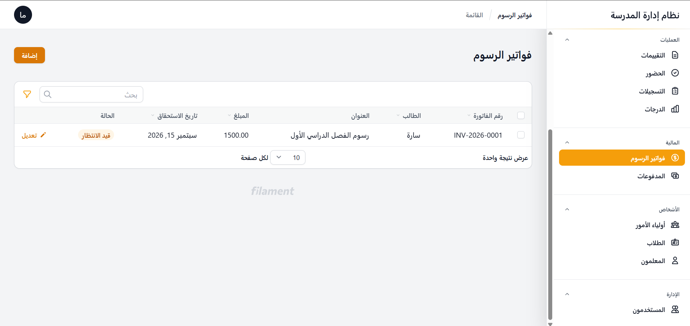

# School Management System

A Laravel administration application for managing core school operations through a Filament dashboard. The project models academic structure, students, guardians, staff, attendance, assessments, marks, and fee records.

## Key Features

- Academic years, grade levels, sections, and subjects
- Student, guardian, teacher, and enrolment records
- Attendance records, assessments, and marks
- Fee invoices and payments
- Role-based access using Spatie Laravel Permission
- Administrative resources built with Filament
- Seeded sample academic data for local evaluation

## Tech Stack

- PHP 8+
- Laravel 9
- Filament 2
- MySQL
- Tailwind CSS 3
- Laravel Mix 6
- Spatie Laravel Permission

## Architecture

The application follows Laravel's MVC structure. Eloquent models represent the school domain, migrations define the relational schema, Filament resources provide administrative CRUD workflows, and roles control dashboard access.

## Screenshots

| Sign in | Academic years | Fee invoices |
| --- | --- | --- |
|  |  |  |

## Getting Started

```bash
cd school-management-system
cp .env.example .env
composer install
php artisan key:generate
npm install
npm run dev
php artisan migrate --seed
php artisan serve
```

Create a MySQL database and update the local `.env` before running migrations. The seeder creates a clearly labelled local demo administrator (`admin@school.test` / `password`) together with sample academic records. Use it only in a disposable development environment and replace it before any shared deployment.

## My Role

I designed and implemented the Laravel data model, migrations, administrative resources, role model, sample data, and dashboard workflows.

## Skills Demonstrated

Laravel application architecture, relational data modelling, Filament administration, authorization, migrations and seeders, MySQL, and Tailwind-based interfaces.

## Project Status and Limitations

This is a portfolio and academic management system, not a production deployment. Before real institutional use it would need broader automated testing, deployment configuration, backup and audit procedures, privacy review, and organization-specific workflows.

## License

No open-source license has been declared.
